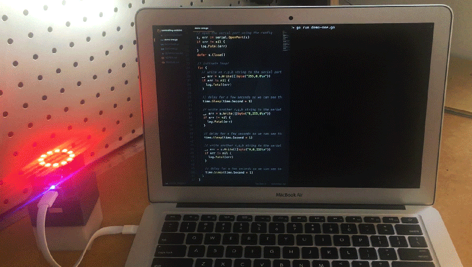

### Controlling Arduino With Go



Lightening talk on controlling Arduino with Go 🐹

#### Setting Up The Arduino

First you'll need to setup the [Arduino IDE](https://www.arduino.cc/en/Main/Software), connect an Arduino to you computer and make sure you can compile.

Once you've done that you can follow the [ReadASCIIString](https://www.arduino.cc/en/Tutorial/ReadASCIIString) demo. This will guide you to setup a simple circuit, compile the code and test send data via the Arduino IDE serial monitor.

You can take a look at this project's `controlling-arduino-with-go.ino` file to see how I adapted the demo to control an Adafruit NeoPixel.

#### Running The Demos

You'll need to make sure you have Go installed and a Go workspace setup. Golang's [How to Write Go Code](https://golang.org/doc/code.html) can help you with that.

Next you'll need to install this package along with tarm's serial package:

```
$ go get -u -d github.com/kivlor/controlling-arduino-with-go kivlor
$ go get -u github.com/tarm/serial
```

Move into this package's directory on your machine, adjust the port and BAUD in each of the demos and you're ready to Go.

##### Demo One

The first demo sends RGB strings to the Arduino via serial. It cycles through red (`255,0,0`), green (`0,255,0`) and green (`0,0,255`). Run with:

```
$ go run demo-one.go
```

##### Demo Two

The second demo uses the `net/http` package to start up a simple web server on port 8080. Run with:

```
$ go run demo-two.go
```

In your browser visit [127.0.0.1:8080](http://127.0.0.1:8080) and you should be given a page of colours. Clicking each will send it's RBG value back to the server to then send to Arduino via serial.

##### Demo Three

The final demo again uses the `net/http` package to start up a simple web server on port 8080. Run with:

```
$ go run demo-two.go
```

This demo is written to receive build web hooks from [Travis CI](https://travis-ci.org/). It converts the build status Pending, Passed and Failed into Yellow, Green and Red RGB values. Like the other demos these RGB values are sent to the Arduino via serial.

This demo hasn't been fully tested so you might need to make some adjustments.

#### Running the Slides

Install the present tool:

```
$ go get -u golang.org/x/tools/present
```

From the directory call `present`:

```
$ present
```

Open your web browser and visit [http://127.0.0.1:3999](http://127.0.0.1:3999)